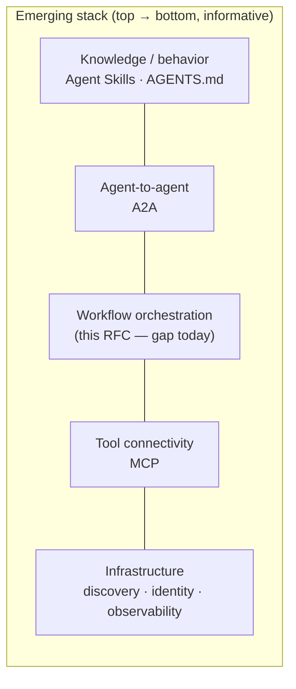
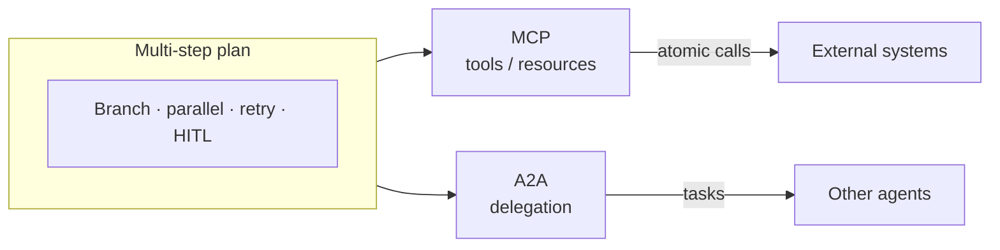

# RFC — Section 1: Abstract and Motivation

**RFC index (root):** [Agent Workflow Protocol — RFC (overview)](rfc-00-overview.md) · *Section 1 of 9*  
**Series:** Agent Workflow Protocol (working title)  
**Related:** [Design Principles](rfc-02-design-principles.md) · [Workflow Definition Schema](rfc-03-workflow-definition-schema.md)

---

## Abstract

Agentic platforms deliver strong language-model reasoning and tool use, but they lack a **vendor-neutral, declarative, auditable standard** for **stateful, multi-step workflow execution** with deterministic recovery, checkpointing, human-in-the-loop interrupts, and composable integration with tool and agent protocols. This specification defines such a protocol: a **workflow definition format** (JSON/YAML with a canonical JSON representation), an **event-sourced execution model** suitable for crash recovery, and **integration interfaces** (including MCP and HTTP APIs) so the same workflow can run across assistants, automation platforms, and embedded SDKs.

## Problem statement

Production agent systems require capabilities that today are fragmented or absent across major frameworks:

- **Durable checkpoint and resume** across process restarts, not merely in-memory state.
- A clear **determinism boundary** between orchestration logic and non-deterministic **activities** (LLM calls, tools, external I/O).
- **Retry, timeout, and compensation** policies as first-class data, not ad hoc code paths.
- **Human-in-the-loop** pauses with typed resume payloads and auditability.
- **Portable workflow definitions** that can be versioned, shared, and executed on more than one engine.

Surveys of the ecosystem (see founding landscape document [`analysis-brief.md`](analysis-brief.md)) indicate that **no single framework** combines all of these in a **standardized, interoperable** package; the closest conceptual fit (e.g. graph-native agent runtimes) often remains **code-first** and **ecosystem-specific**, which blocks cross-platform reuse.

## Standards stack and gap

The emerging stack for agent systems is layering:

| Layer | Role | Examples |
|-------|------|----------|
| Knowledge / behavior | Skills, agent instructions | Agent Skills, AGENTS.md |
| Agent-to-agent | Delegation, tasks, cards | A2A |
| Tool connectivity | Atomic capabilities | MCP |
| Infrastructure | Discovery, identity, messaging | AGNTCY, observability stacks |
| **Workflow orchestration** | **Stateful plans between tools and agents** | **(gap — this RFC)** |

The same layering is shown below (informative): higher layers depend on lower transport and orchestration capabilities.

**Model Context Protocol (MCP)** succeeded in part by solving an immediate integration pain with a small surface area and working implementations. **This protocol** targets the adjacent pain: **what happens after** the model chooses a multi-step plan — coordinating steps, branching, parallelism, interrupts, and replayable execution — while **composing MCP** for tool steps and **A2A** (or equivalent) for agent delegation where applicable.

## Opportunity

A workflow protocol that is:

- **Declarative-first** with optional code-first SDKs compiling to the same canonical model,
- **Replay-friendly** via explicit commands and events,
- **Checkpoint-capable** per node or policy,
- **MCP- and HTTP-friendly** for assistants and automation tools,

can become the **shared orchestration layer** between atomic tool calls and multi-agent collaboration — analogous to how MCP normalized tools across clients.

## Document roadmap

- **Section 2** states non-negotiable design principles.  
- **Section 3** normatively defines the workflow definition schema.  
- **Section 4** defines execution semantics and replay.  
- **Sections 5–7** cover interfaces, interoperability, and security.  
- **Sections 8–9** cover reference implementation and governance.

## Informative references

Founding analysis and market context are maintained in [`docs/analysis-brief.md`](analysis-brief.md). Quantitative claims in that document SHOULD be re-verified before publication as an Internet-Draft or foundation specification.
