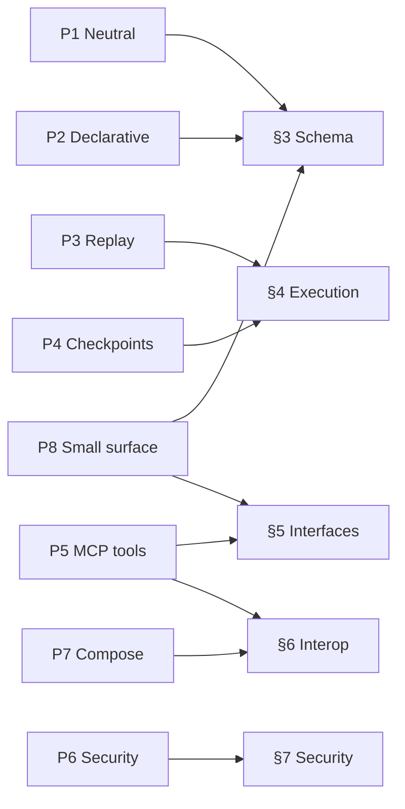

# RFC — Section 2: Design Principles

**RFC index (root):** [Agent Workflow Protocol — RFC (overview)](rfc-00-overview.md) · *Section 2 of 9*  
**Series:** Agent Workflow Protocol (working title)  
**Related:** [Abstract and Motivation](rfc-01-abstract-motivation.md) · [Workflow Definition Schema](rfc-03-workflow-definition-schema.md) · [Security Model](rfc-07-security-model.md)

---

This section lists **non-negotiable principles** for the protocol. Conformant engines and tooling **SHOULD** adhere to them unless an exception is explicitly justified in deployment-specific profiles.

The following map (informative) shows where each principle is elaborated normatively in later sections:

## P1 — Vendor-neutral and language-agnostic

Workflow definitions **MUST** be expressible in a **canonical JSON** form independent of any single vendor SDK. Authoring in YAML or via language SDKs **MAY** compile to that canonical form. No conformant feature **MAY** require a single programming language or proprietary runtime.

## P2 — Declarative-first, ergonomic code-first

The **source of truth** for interchange, versioning, and API transport is the **declarative document**. Python and TypeScript (and other) SDKs **SHOULD** provide ergonomic builders that compile to the same canonical JSON **without** introducing semantics unavailable in declarative form.

## P3 — Deterministic replay for orchestration

Orchestration logic **MUST** be structured so that **replay** of execution can be performed by re-driving deterministic decision code against an **append-only event history**, matching proven patterns from durable workflow systems. Non-deterministic work **MUST** occur only inside declared **activities** (e.g. LLM, tool calls) whose results are **recorded** and **replayed** from history.

## P4 — Checkpointable executions

Engines **MUST** support **durable checkpoints** at defined boundaries (e.g. after each node, or per policy). Checkpoints **MUST** suffice to **resume** execution after process failure without re-executing completed activities inconsistently with recorded history.

## P5 — MCP-compatible tool invocation

Invoking external tools **SHOULD** align with **MCP** semantics where possible (discovery, invocation, structured errors) so workflows can run unmodified across MCP-capable clients and servers. Engines **MAY** support non-MCP tools via adapters.

## P6 — Security and auth in version one

**Authentication, authorization, secret handling, and audit logging** are **first-class** concerns. The protocol **MUST NOT** treat security as an afterthought; see [Security Model](rfc-07-security-model.md).

## P7 — Composability over competition

This protocol **SHOULD** compose with **MCP**, **A2A**, and existing durable workflow backends (e.g. as optional execution substrates) rather than redefining those layers.

## P8 — Small conceptual surface

The **core** author and implementer surface **SHOULD** remain learnable: a bounded set of node kinds, a single expression profile (jq), and a clear command/event model — mirroring successful adoption patterns for cross-cutting protocols.

## Traceability matrix (informative)

| Principle | Primary normative home |
|-----------|-------------------------|
| P1, P2 | [Workflow Definition Schema](rfc-03-workflow-definition-schema.md) |
| P3, P4 | [Execution Model](rfc-04-execution-model.md) |
| P5 | [Interoperability](rfc-06-interoperability.md), [Integration Interfaces](rfc-05-integration-interfaces.md) |
| P6 | [Security Model](rfc-07-security-model.md) |
| P7 | [Interoperability](rfc-06-interoperability.md) |
| P8 | Sections 3–5 (overall structure) |
