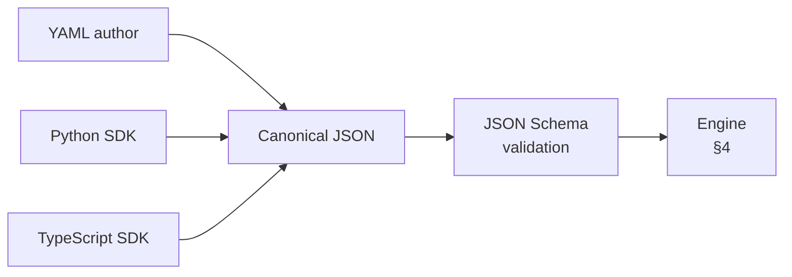
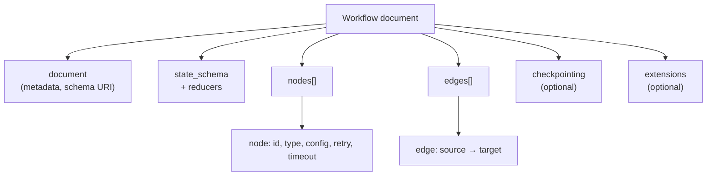
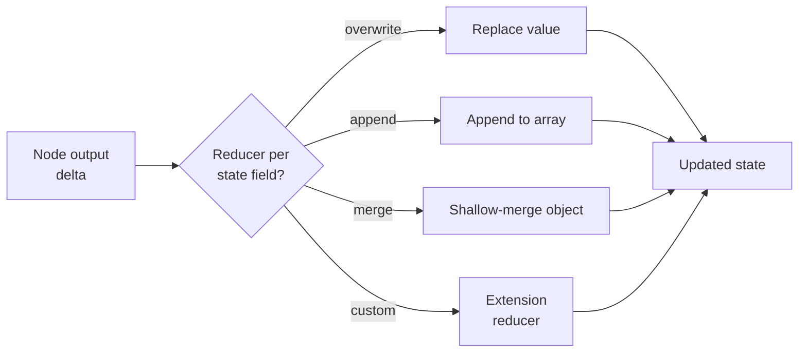

# RFC — Section 3: Workflow Definition Schema

**RFC index (root):** [Agent Workflow Protocol — RFC (overview)](rfc-00-overview.md) · *Section 3 of 9*  
**Series:** Agent Workflow Protocol (working title)  
**Related:** [Design Principles](rfc-02-design-principles.md) · [Execution Model](rfc-04-execution-model.md) · [Integration Interfaces](rfc-05-integration-interfaces.md)

---

## 3.1 Canonical representation

- Workflow definitions **MUST** have a **canonical JSON** serialization suitable for validation, signing, and byte-stable hashing.
- Authors **MAY** author in **YAML**; a conformant toolchain **MUST** define a deterministic YAML → JSON mapping (YAML 1.2, explicit tags as needed).
- The document **MUST** declare a `document.schema` URI identifying the protocol version (e.g. `https://example.org/agent-workflow/v1` — final URI assigned by governance).

Authoring can start in several forms; all **MUST** normalize to the same canonical JSON before validation and execution (informative):



## 3.2 Top-level document structure

A conformant document contains:

| Field | Requirement | Description |
|-------|-------------|-------------|
| `document` | REQUIRED | Metadata: `schema`, `name`, `version`, optional `description`. |
| `state_schema` | REQUIRED | JSON Schema object describing workflow state shape. |
| `nodes` | REQUIRED | Non-empty array of node objects. |
| `edges` | REQUIRED | Array of directed edges (see §3.6). |
| `checkpointing` | OPTIONAL | Default checkpoint policy and storage hints. |
| `extensions` | OPTIONAL | Vendor extensions; **MUST** use reverse-DNS keys. |

Engines **MUST** reject documents failing JSON Schema validation when validation is enabled.

Top-level containment (informative):



## 3.3 Expression language (jq)

- Conditions, mappings, and transforms **MUST** be expressed in **jq** syntax unless a deployment profile registers an alternative engine (profile **MUST** name compatibility rules).
- Expressions **SHOULD** operate on **execution state** as jq input (root object). Engines **MUST** document the exact binding (e.g. whole state vs wrapped `{ state, context }`).
- For **portability**, conformant documents **SHOULD** limit themselves to jq constructs supported by a defined **conformance subset** (governance SHALL publish the subset or reference an existing profile).

## 3.4 State schema and reducers

`state_schema` is a JSON Schema for the **workflow state** object. Each property **MAY** include a `reducer` annotation (string enum):

| Reducer | Semantics on update |
|---------|---------------------|
| `overwrite` | Replace value (default). |
| `append` | Append to array (value **MUST** be array or coerced per engine rules — engine **MUST** document coercion). |
| `merge` | Shallow merge objects (both **MUST** be objects). |
| `custom` | Named reducer registered by extension; **MUST** be rejected if unsupported. |

Engines **MUST** apply reducers when merging node outputs into state according to [Execution Model](rfc-04-execution-model.md).

Reducer flow when a node completes (informative):



## 3.5 Node object (common fields)

Each node **MUST** have:

- `id` (string, unique within document)
- `type` (one of the discriminators in §3.7)

Each node **MAY** have:

- `config` (object, type-specific)
- `retry` (retry policy object, §3.8)
- `timeout` (duration string, e.g. `30s`, `24h`)
- `metadata` (object for tooling)

## 3.6 Edges

Edges connect nodes:

```json
{ "source": "node_id_or___start__", "target": "node_id" }
```

- `__start__` **MAY** be used as a synthetic source for the unique `start` node.
- For `switch`, outgoing edges **MAY** be implicit via `cases`; if both exist, engines **MUST** define precedence (recommended: `switch` targets override static edges).

## 3.7 Node types (normative)

### `start`

Entry node; **MUST** appear at most once unless engine profile allows multiple entrypoints.  
`config` **MAY** include `input_schema` (JSON Schema) for execution inputs.

### `end`

Terminal node; **MAY** include `output_schema` and `output_mapping` (jq) to build final result.

### `step`

Deterministic user code or sandboxed logic. `config` **MUST** include a **reference** to implementation (e.g. `handler: "urn:..."` or `code_ref`) — exact registry **TBD** by implementation profile. **MUST NOT** perform non-deterministic I/O inside the node unless that work is modeled as an activity (`llm_call`, `tool_call`, or another profile-defined activity boundary). The engine **MAY** run activities in-process **OR** delegate invocation to the host per the integration profile ([Section 5](rfc-05-integration-interfaces.md)).

### `llm_call`

Non-deterministic model invocation. `config` **SHOULD** include: `model`, prompts (system/user), `output_schema` or free-text mode, and optional tool allowlist.

### `tool_call`

External tool invocation; **SHOULD** be MCP-shaped (`server`, `tool`, `arguments`) in portable profiles.

### `switch`

Conditional routing without new state writes unless combined with `set_state`.  
`config` **MUST** include `cases`: array of `{ when: jq-expression, target: node-id }` and optional `default` target.

### `parallel`

Fork/join. `config` **MUST** include `branches` (named subgraphs referencing node `id`s or inline node lists per engine profile), `join` enum: `all` | `any` | `n_of_m` (with `n`), and optional per-branch timeouts.

### `interrupt`

Human-in-the-loop or external approval. `config` **MUST** include `prompt` or reference, `resume_schema` (JSON Schema), optional `timeout`, optional assignee hints.

### `agent_delegate`

Delegation to another agent runtime. `config` **SHOULD** include `agent_id`, `protocol` (`a2a` | `mcp` | `sdk`), `input_mapping` (jq or object template).

### `subworkflow`

Nested workflow. `config` **MUST** include `workflow_ref` (URI or registry id) and `input_mapping`; **MAY** include `version_pin`.

### `wait`

Timer or external event. `config` **MUST** specify `kind`: `duration` | `until` | `signal` and corresponding parameters.

### `set_state`

Declarative state update. `config` **MUST** include `assignments`: map of state paths to jq expressions or literals.

## 3.8 Retry and timeout

### Retry policy object

| Field | Type | Description |
|-------|------|-------------|
| `max_attempts` | integer | **MUST** be ≥ 1 |
| `initial_interval` | duration | optional |
| `backoff_coefficient` | number | optional |
| `max_interval` | duration | optional |
| `non_retryable_errors` | array | optional list of error codes/types |

Timeouts **SHOULD** use ISO 8601 durations or common suffixed forms (`ms`, `s`, `m`, `h`); profiles **MUST** fix parsing rules.

## 3.9 Checkpointing block

```yaml
checkpointing:
  strategy: after_each_node   # or explicit list, or policy ref
  storage:
    type: sqlite
    path: "./checkpoints.db"
```

Engines **MUST** support at least one durable storage backend in reference implementations; see [Reference Implementation](rfc-08-reference-implementation.md).

## 3.10 JSON Schema packaging

Governance **SHALL** publish a normative JSON Schema bundle:

- `workflow-document.schema.json`
- `node-*.schema.json` (or single `oneOf` discriminated union)

This RFC text is authoritative for semantics; schemas are authoritative for syntactic validation.

---

## 3.11 Worked examples (informative)

### Example A — Customer support routing

```yaml
document:
  schema: "https://example.org/agent-workflow/v1"
  name: "customer-support"
  version: "1.0.0"
state_schema:
  type: object
  properties:
    messages: { type: array, reducer: append }
    intent: { type: string }
    confidence: { type: number }
nodes:
  - id: classify
    type: llm_call
    config:
      model: "claude-sonnet-4-20250514"
      system_prompt: "Classify the user intent"
      output_schema:
        type: object
        properties:
          intent: { type: string }
          confidence: { type: number }
    retry: { max_attempts: 3, backoff_coefficient: 2 }
    timeout: "30s"
  - id: route
    type: switch
    config:
      cases:
        - when: '.intent == "billing" and .confidence > 0.8'
          target: billing_handler
        - when: '.intent == "technical"'
          target: tech_handler
      default: human_review
  - id: human_review
    type: interrupt
    config:
      prompt: "Agent is unsure. Please review and classify."
      timeout: "24h"
      resume_schema:
        type: object
        properties:
          intent: { type: string }
  - id: billing_handler
    type: tool_call
    config:
      tool: "create_ticket"
      server: "support-mcp"
  - id: tech_handler
    type: tool_call
    config:
      tool: "search_kb"
      server: "support-mcp"
edges:
  - { source: __start__, target: classify }
  - { source: classify, target: route }
```

### Example B — Research and summarize (parallel)

```yaml
document:
  schema: "https://example.org/agent-workflow/v1"
  name: "research-summarize"
  version: "1.0.0"
state_schema:
  type: object
  properties:
    topic: { type: string }
    findings: { type: array, reducer: append }
    summary: { type: string }
nodes:
  - id: plan
    type: llm_call
    config:
      model: "gpt-4.1"
      system_prompt: "Produce search queries for the topic"
  - id: research
    type: parallel
    config:
      join: all
      timeout: "120s"
      branches:
        - name: web
          nodes: [web_search, web_digest]
        - name: internal
          nodes: [vector_search, internal_digest]
  - id: web_search
    type: tool_call
    config: { tool: "web.search", arguments: { query: "${ .queries[0] }" } }
  - id: web_digest
    type: llm_call
    config: { model: "gpt-4.1-mini", system_prompt: "Digest web results" }
  - id: vector_search
    type: tool_call
    config: { tool: "kb.search", server: "corp-mcp" }
  - id: internal_digest
    type: llm_call
    config: { model: "gpt-4.1-mini", system_prompt: "Digest internal hits" }
  - id: summarize
    type: llm_call
    config:
      model: "gpt-4.1"
      system_prompt: "Write final summary from findings"
edges:
  - { source: __start__, target: plan }
  - { source: plan, target: research }
  - { source: research, target: summarize }
```

*(Note: parallel branch node wiring is illustrative; exact embedding rules depend on profile — engines **SHOULD** support explicit subgraph ids.)*

### Example C — Multi-agent coding task (delegate + subworkflow)

```yaml
document:
  schema: "https://example.org/agent-workflow/v1"
  name: "coding-task"
  version: "1.0.0"
state_schema:
  type: object
  properties:
    task: { type: string }
    patch: { type: string }
    review_ok: { type: boolean }
nodes:
  - id: implement
    type: agent_delegate
    config:
      agent_id: "coder"
      protocol: "a2a"
      input_mapping: { task: "${ .task }" }
  - id: verify
    type: subworkflow
    config:
      workflow_ref: "urn:awp:wf:unit-tests"
      input_mapping: { repo: "${ .repo }" }
  - id: review
    type: interrupt
    config:
      prompt: "Approve patch for merge?"
      resume_schema:
        type: object
        properties:
          approve: { type: boolean }
edges:
  - { source: __start__, target: implement }
  - { source: implement, target: verify }
  - { source: verify, target: review }
```

### Example D — Agentic task intake and prompt improver

```yaml
document:
  schema: "https://example.org/agent-workflow/v1"
  name: "agentic-task-intake"
  version: "1.0.0"
state_schema:
  type: object
  properties:
    user_request: { type: string }
    intention: { type: string }
    task_size: { type: string }
    selected_skills: { type: array, reducer: append }
    selected_tools: { type: array, reducer: append }
    context_bundle: { type: object }
    execution_mode: { type: string }   # "workflow" | "open_agentic"
    improved_prompt: { type: string }
    workflow_draft: { type: object }
nodes:
  - id: detect_intention
    type: llm_call
    config:
      model: "gpt-4.1-mini"
      system_prompt: "Infer user intent from request."
  - id: estimate_task_size
    type: llm_call
    config:
      model: "gpt-4.1-mini"
      system_prompt: "Estimate complexity and classify as small, medium, or large."
  - id: gather_capabilities
    type: tool_call
    config:
      tool: "capability.catalog.lookup"
      server: "orchestration-mcp"
  - id: gather_workspace_context
    type: tool_call
    config:
      tool: "workspace.context.collect"
      server: "orchestration-mcp"
  - id: compose_plan_prompt
    type: llm_call
    config:
      model: "gpt-4.1"
      system_prompt: "Compose an execution-ready prompt and choose execution_mode."
      output_schema:
        type: object
        properties:
          execution_mode: { type: string }
          improved_prompt: { type: string }
          workflow_draft: { type: object }
  - id: route_mode
    type: switch
    config:
      cases:
        - when: '.execution_mode == "workflow"'
          target: publish_workflow
      default: dispatch_open_agent
  - id: publish_workflow
    type: tool_call
    config:
      tool: "workflow.publish_draft"
      server: "orchestration-mcp"
  - id: dispatch_open_agent
    type: agent_delegate
    config:
      agent_id: "generalist-agent"
      protocol: "a2a"
      input_mapping:
        prompt: "${ .improved_prompt }"
edges:
  - { source: __start__, target: detect_intention }
  - { source: detect_intention, target: estimate_task_size }
  - { source: estimate_task_size, target: gather_capabilities }
  - { source: gather_capabilities, target: gather_workspace_context }
  - { source: gather_workspace_context, target: compose_plan_prompt }
  - { source: compose_plan_prompt, target: route_mode }
```

---

## 3.12 Extensibility

Vendor extensions **MUST** live under `extensions` with collision-safe keys. Unknown `type` values **MUST** be rejected unless the engine registers an extension providing semantics.
