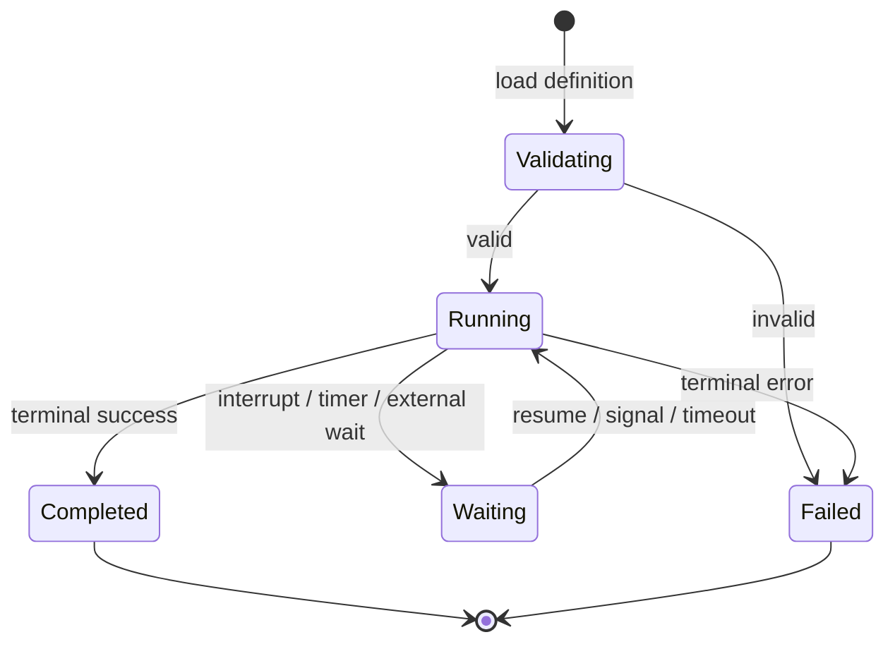
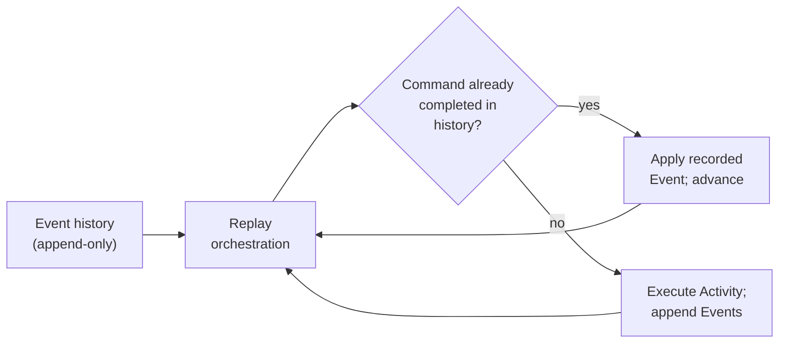
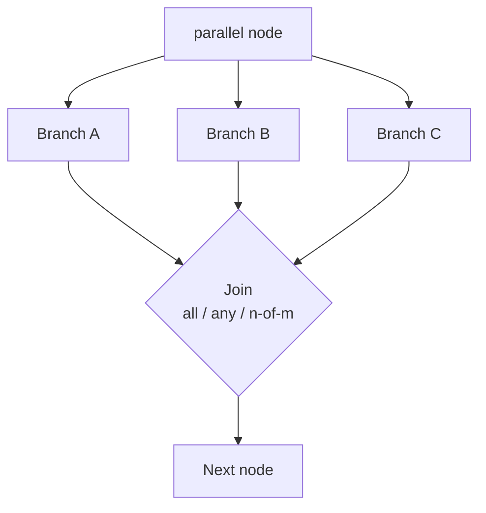
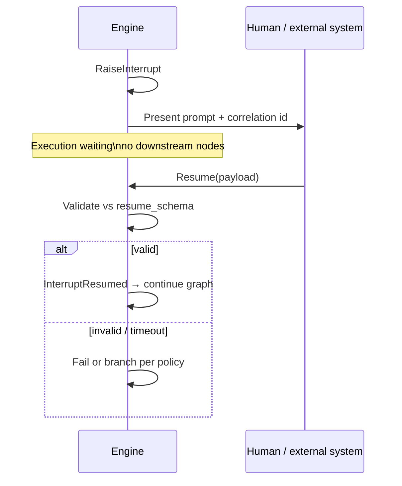
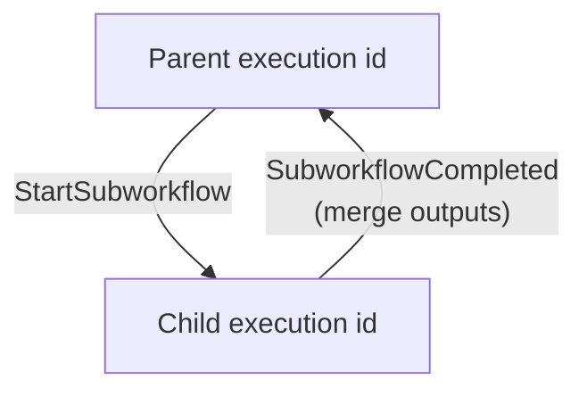

# RFC — Section 4: Execution Model

**RFC index (root):** [Agent Workflow Protocol — RFC (overview)](rfc-00-overview.md) · *Section 4 of 9*  
**Series:** Agent Workflow Protocol (working title)  
**Related:** [Workflow Definition Schema](rfc-03-workflow-definition-schema.md) · [Integration Interfaces](rfc-05-integration-interfaces.md) · [Security Model](rfc-07-security-model.md)

---

## 4.1 Execution identity

Each run of a workflow definition **MUST** have a unique **execution id** (UUID or engine-defined opaque string). All Commands, Events, and checkpoints **MUST** be scoped to that execution id.

## 4.2 Phases

1. **Validate** definition (schema + static checks).  
2. **Start** execution: bind inputs, initialize state, append `ExecutionStarted`.  
3. **Walk** graph: emit Commands, schedule Activities, append Events.  
4. **Checkpoint** per policy.  
5. **Complete** or **fail** terminally; emit `ExecutionCompleted` or `ExecutionFailed`.

Simplified lifecycle (informative; see §4.2 for detailed phases):

## 4.3 Deterministic replay

The engine **MUST** separate:

- **Orchestration code** — given the same history prefix, produces the same next **Command** sequence (modulo explicit nondeterminism hooks forbidden in orchestration).
- **Activities** — LLM calls, tools, subprocesses; **MAY** yield different results across attempts; **MUST** have results **recorded** as Events.

On recovery, the engine **MUST**:

1. Load history and checkpoint.  
2. Re-drive orchestration from the beginning or last safe replay point.  
3. For each Command that already has a matching completed Event, **skip** re-execution of the Activity and **advance** state from the Event.  
4. Continue until reaching the tail or a new Command requiring live execution.

Engines **MUST** detect **nondeterminism** (orchestration divergence vs history) and **MUST** fail the execution with a defined error code.

Recovery replay (informative):

## 4.4 Command taxonomy (normative)

Commands express **intent** from orchestration. Minimum set:

| Command | Purpose |
|---------|---------|
| `ScheduleNode` | Run node `id` with current state snapshot reference. |
| `CompleteNode` | Record successful node completion with output delta. |
| `FailNode` | Record failure with typed error. |
| `StartParallel` | Begin parallel branches with branch ids. |
| `JoinParallel` | Wait for join semantics (`all` / `any` / `n_of_m`). |
| `StartTimer` / `CancelTimer` | Durable timers for `wait`. |
| `RaiseInterrupt` | Enter interrupt state; wait for external completion. |
| `ResumeInterrupt` | Apply resume payload to state; continue graph. |
| `StartSubworkflow` | Begin child execution; correlate child id. |
| `CompleteSubworkflow` | Merge child outputs per policy. |
| `EmitSignal` | Internal/external signal for event-driven waits. |

Governance **MAY** extend the set; extensions **MUST** be versioned.

## 4.5 Event taxonomy (normative)

Events are **append-only** records. Minimum set:

| Event | Description |
|-------|-------------|
| `ExecutionStarted` | Inputs, definition hash/version. |
| `NodeScheduled` | Node id, attempt. |
| `ActivityRequested` | Serialized activity descriptor (model, tool, etc.). |
| `ActivityCompleted` | Structured result (or reference to blob storage). |
| `ActivityFailed` | Error type, message, retry count. |
| `StateUpdated` | Optional diff or post-reducer snapshot hash. |
| `CheckpointWritten` | Storage locator, sequence number. |
| `InterruptRaised` | Prompt metadata, correlation id. |
| `InterruptResumed` | Validated resume payload. |
| `SubworkflowStarted` / `SubworkflowCompleted` | Child execution correlation. |
| `ExecutionCompleted` | Terminal outputs. |
| `ExecutionFailed` | Terminal error. |

Events **SHOULD** carry **monotonic sequence numbers** and **causation** fields (parent command id).

## 4.6 State updates and reducers

When a node completes, the engine **MUST**:

1. Compute proposed updates from node outputs.  
2. Apply **reducers** per `state_schema` annotations.  
3. Validate resulting state against `state_schema` if validation is enabled.  
4. Append `StateUpdated` (or embed in `ActivityCompleted` per profile).

## 4.7 Parallelism

For `parallel` nodes:

- Branches **MUST** be labeled and **SHOULD** execute concurrently when resources allow.  
- `join: all` — wait for all branches; failed branch handling **SHOULD** follow `retry` on inner nodes or fail parallel parent per policy.  
- `join: any` — first terminal success **MAY** cancel siblings (engine **MUST** document cancellation semantics).  
- `n_of_m` — engine **MUST** validate `n` ≤ branch count.

Partial branch state **MUST** be merged according to reducer rules on branch outputs.

`parallel` fork/join (informative):

## 4.8 Interrupt and resume protocol

1. Engine reaches `interrupt` node → `RaiseInterrupt` → `InterruptRaised` Event.  
2. Execution moves to **waiting** state; no downstream nodes run until resume.  
3. External actor submits **resume** payload **MUST** validate against `resume_schema`.  
4. On success → `ResumeInterrupt` → `InterruptResumed` → continue to next node per graph.  
5. On timeout → `ActivityFailed` or dedicated `InterruptTimedOut` per profile; workflow **SHOULD** support configurable compensation path.

## 4.9 Sub-workflows

- Child executions **MUST** have distinct execution ids **linked** to parent via correlation fields.  
- Parent **MAY** pass input mapping; child outputs **MAY** map to parent state via declared merge rules.  
- Cancellation of parent **SHOULD** propagate to children unless `detached: true` (extension).

Parent/child correlation (informative):

## 4.10 Checkpointing

Checkpoints **MUST** include at minimum:

- Execution id, definition version/hash  
- Sequence number of last applied Event  
- Serializable execution pointer (current node(s), join counters)  
- State snapshot or content-addressed reference to state blob

Engines **SHOULD** support `after_each_node` and **MAY** support coarser strategies for performance.

## 4.11 Idempotency and retries

Activity retries **MUST** be driven by policy and **MUST** append new Events per attempt (or a single superseding Event if engine uses idempotency keys — **MUST** be documented). Duplicate external side effects **SHOULD** be mitigated via **idempotency keys** in `tool_call` / `llm_call` profiles.
