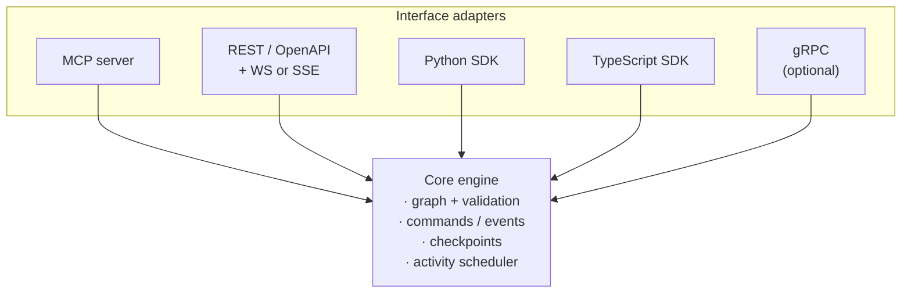
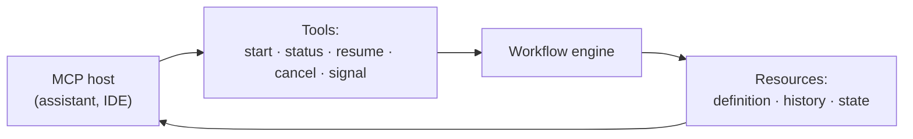

# RFC — Section 5: Integration Interfaces

**RFC index (root):** [Agent Workflow Protocol — RFC (overview)](rfc-00-overview.md) · *Section 5 of 9*  
**Series:** Agent Workflow Protocol (working title)  
**Related:** [Workflow Definition Schema](rfc-03-workflow-definition-schema.md) · [Execution Model](rfc-04-execution-model.md) · [Interoperability](rfc-06-interoperability.md)

---

## 5.1 Architecture pattern

Engines **SHOULD** follow a **core + adapters** layout:

- **Core:** graph validation, command/event processing, checkpoint store, activity scheduling.  
- **Adapters:** MCP, HTTP/REST, language SDKs, optional gRPC.

All adapters **MUST** map to the same internal APIs so behavior is consistent across surfaces.

## 5.2 MCP server interface

An engine **MAY** expose an MCP server. Recommended **tools** (names illustrative — governance registers final names):

| Tool | Purpose |
|------|---------|
| `workflow_start` | Start execution from definition ref or inline document; returns `execution_id`. |
| `workflow_status` | Return phase, current node(s), last error. |
| `workflow_resume` | Resume from interrupt with payload. |
| `workflow_cancel` | Request cooperative cancellation. |
| `workflow_signal` | Send named signal for `wait` / extensions. |
| `workflow_list` | List executions with filters (optional). |

Recommended **resources** (URI schemes illustrative):

| Resource | Content |
|----------|---------|
| `workflow://definitions/{id}` | Canonical JSON definition. |
| `workflow://executions/{id}/history` | Event log (paginated). |
| `workflow://executions/{id}/state` | Current state snapshot (access-controlled). |

MCP transport **MUST** follow MCP baseline (stdio and/or HTTP per host). Authentication **MUST** align with [Security Model](rfc-07-security-model.md).

Control-plane data flow (informative):

## 5.3 REST API

Engines **SHOULD** provide an **OpenAPI 3.0** description. Normative bundling:

- Publish `openapi.yaml` alongside the specification **OR** embed a URL in governance metadata.

### Minimal resource map

| Method | Path | Description |
|--------|------|-------------|
| `POST` | `/v1/workflows` | Create/register definition. |
| `GET` | `/v1/workflows/{wf_id}` | Fetch definition. |
| `POST` | `/v1/workflows/{wf_id}/executions` | Start execution. |
| `GET` | `/v1/executions/{exec_id}` | Status. |
| `GET` | `/v1/executions/{exec_id}/events` | Paginated history. |
| `POST` | `/v1/executions/{exec_id}:resume` | Interrupt resume. |
| `POST` | `/v1/executions/{exec_id}:cancel` | Cancel. |
| `GET` | `/v1/executions/{exec_id}/checkpoint` | Optional introspection. |

### Streaming

Engines **MAY** expose **WebSocket** or **SSE** for event streams; payload format **SHOULD** mirror the Event taxonomy in [Execution Model](rfc-04-execution-model.md).

## 5.4 Python SDK (normative surface, informative signatures)

The Python SDK **SHOULD** provide:

- `WorkflowClient.connect(url | mcp_session)` — unified entrypoint.  
- `Definition.load(path | dict)` — parse/validate.  
- `Execution.start(definition, inputs)` → `ExecutionHandle`.  
- `ExecutionHandle.wait()` / `async for event in handle.events()`  
- Decorator builders **MAY** compile to canonical JSON (profile).

## 5.5 TypeScript SDK

Mirror §5.4 with Promise/async iterator idioms. Types **SHOULD** be generated from JSON Schema.

## 5.6 Wire protocol (SDK ↔ core)

When SDKs talk to a remote core:

- **MUST** use HTTPS with TLS 1.2+.  
- **SHOULD** use JSON bodies and the REST paths in §5.3 or a documented gRPC proto.  
- **MUST** propagate **trace context** (W3C Trace Context) on mutating calls.  
- **SHOULD** support **execution-scoped auth tokens** with least privilege.

## 5.7 Version negotiation

Clients **MUST** send `Accept-Version` or `X-Agent-Workflow-Version` header; servers **MUST** reject unsupported combinations with a defined error body referencing supported versions.
