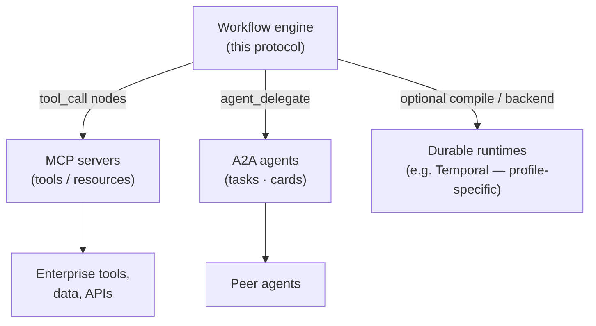

# RFC — Section 6: Interoperability

**RFC index (root):** [Agent Workflow Protocol — RFC (overview)](rfc-00-overview.md) · *Section 6 of 9*  
**Series:** Agent Workflow Protocol (working title)  
**Related:** [Integration Interfaces](rfc-05-integration-interfaces.md) · [Security Model](rfc-07-security-model.md) · [Abstract and Motivation](rfc-01-abstract-motivation.md)

---

Composition with adjacent standards (informative):

## 6.1 Composing MCP

Workflows **SHOULD** represent `tool_call` nodes in a way that maps 1:1 to MCP **tools/call** when the tool is provided by an MCP server:

- Tool name and arguments **MUST** serialize to MCP-compliant JSON.  
- Errors **SHOULD** map MCP error codes to workflow `ActivityFailed` types for retry policy.

In **host-mediated** profiles (recommended for assistant hosts), the engine emits `ActivityRequested` and the **MCP host** performs MCP **tools/call** (or the equivalent LLM or handler invocation); results return via the engine control plane (§5.2). In **engine-direct** profiles, the engine runtime **MAY** open MCP client connections or invoke equivalent local handlers; the composition diagram above remains **logical** (`tool_call` maps to MCP tools). **Host-mediated** deployment does **not** require the engine process to open MCP client connections.

Engines **MAY** host a **meta-MCP** that exposes workflow control tools (see §5.2) so any MCP-capable client can start and observe workflows.

## 6.2 Composing A2A and agent delegation

For `agent_delegate` with `protocol: a2a`:

- Engines **SHOULD** use **Agent Cards** for discovery where available.  
- Task lifecycle (submitted → working → input-required → completed) **SHOULD** map to workflow Commands/Events (e.g. child `interrupt` when A2A reports `input-required`).  
- Correlation ids **MUST** link A2A task ids to parent execution Events.

## 6.3 Platform integration patterns (informative)

| Platform class | Pattern |
|----------------|---------|
| **Assistant hosts** (e.g. Claude Desktop, Cursor) | Register engine MCP server; drive workflows via tools; fetch history via resources. |
| **Visual builders** (e.g. Dify-class, Flowise-class) | Generate canonical JSON from canvas; HTTP `POST` to engine; poll or stream events. |
| **Automation** (e.g. n8n-class) | HTTP nodes for lifecycle; map webhook resume to `workflow_resume`. |
| **Code-first agent frameworks** | Embed SDK; compile graphs to JSON; optional remote core for durability. |

Exact vendor mappings **SHOULD** be maintained in implementation guides, not in the core RFC.

## 6.4 LangGraph and similar graph import (informative)

Adapters **MAY** translate from framework-native graphs to canonical JSON by:

1. Mapping state channels to `state_schema` with reducers.  
2. Mapping nodes to `llm_call`, `tool_call`, `switch`, etc.  
3. Emitting explicit `edges` or `switch` targets for conditional edges.  
4. Marking non-exportable dynamic lambdas as `step` with registered handlers.

Import **MAY** be lossy; adapters **SHOULD** emit a **compatibility report** listing unsupported constructs.

## 6.5 Temporal and durable backends (informative)

Organizations **MAY** compile workflow definitions to **Temporal** (or similar) workflows for enterprise durability. The canonical JSON remains the **authoring interchange**; compilation is **implementation-specific** and **MUST NOT** redefine core semantics without a published translation spec.

## 6.6 CNCF Serverless Workflow alignment (informative)

This schema extends portable workflow concepts (`switch`, `wait`, parallel constructs, error handling) with **AI-specific** nodes. Where constructs align, mappings **SHOULD** be documented to reduce dual-authoring.
