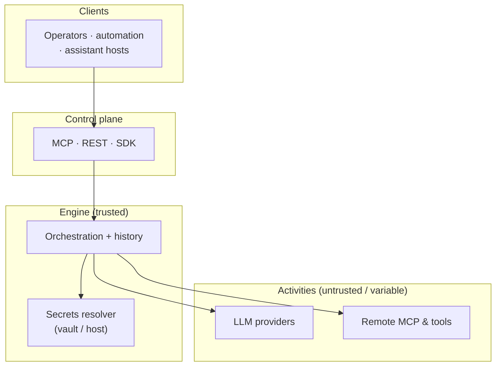

# RFC — Section 7: Security Model

**RFC index (root):** [Agent Workflow Protocol — RFC (overview)](rfc-00-overview.md) · *Section 7 of 9*  
**Series:** Agent Workflow Protocol (working title)  
**Related:** [Design Principles](rfc-02-design-principles.md) · [Integration Interfaces](rfc-05-integration-interfaces.md) · [Execution Model](rfc-04-execution-model.md)

---

## 7.1 Threat model (informative)

Typical threats:

- **Unauthorized start/resume/cancel** of executions.  
- **Secret exfiltration** via tool arguments or LLM prompts.  
- **Prompt injection** altering tool selection or data flows inside `llm_call`.  
- **Poisoned definitions** (supply chain) executing harmful tools.  
- **Cross-tenant data leakage** via shared engines or logs.

Trust boundaries (informative):

## 7.2 Authentication and authorization

Engines **MUST** authenticate callers on every control plane API (MCP, REST, SDK remote).

- **MUST** support **scoped tokens** tied to tenant/project and least-privilege actions (`start`, `resume`, `read_history`).  
- **SHOULD** support **OAuth 2.1**-style flows for user-delegated resume on interrupts.  
- **MUST** enforce **authorization** on definition registration and execution readback.

## 7.3 Secrets management

- Long-lived credentials **MUST NOT** be embedded in workflow definitions stored in shared repos.  
- Engines **SHOULD** resolve secrets from **vaults** or **host-injected** secret stores at runtime, referenced by stable ids (e.g. `secret_ref`).  
- Activity arguments **SHOULD** be redacted in default audit logs (see §7.5).

## 7.4 LLM nodes and prompt injection

For `llm_call` nodes:

- Engines **SHOULD** support **tool allowlists** and **output schema** validation to constrain behavior.  
- **SHOULD** separate **trusted system instructions** from untrusted user content with clear delimiters (implementation guide).  
- **MUST** surface injection attempts in audit telemetry where detectable (e.g. policy violations).

## 7.5 Audit logging

- Engines **SHOULD** emit **OpenTelemetry** traces for Commands/Activities and structured logs for security-relevant events.  
- Log fields **SHOULD** include: execution id, definition hash, actor id, node id, attempt, error codes.  
- PII **SHOULD** be classified and **MAY** be omitted or hashed per policy.

## 7.6 Transport and MCP-specific considerations

- TLS for HTTP; stdio MCP **MUST** rely on OS process isolation and host-configured trust boundaries.  
- Learn from MCP ecosystem lessons: prefer **dynamic discovery** where large tool manifests risk context exhaustion; validate **server identity** when using remote MCP.

## 7.7 Definition signing (optional profile)

Deployments **MAY** require **signed definitions** (e.g. Sigstore/cosign). Engines **MUST** verify signatures before execution when this profile is enabled.
