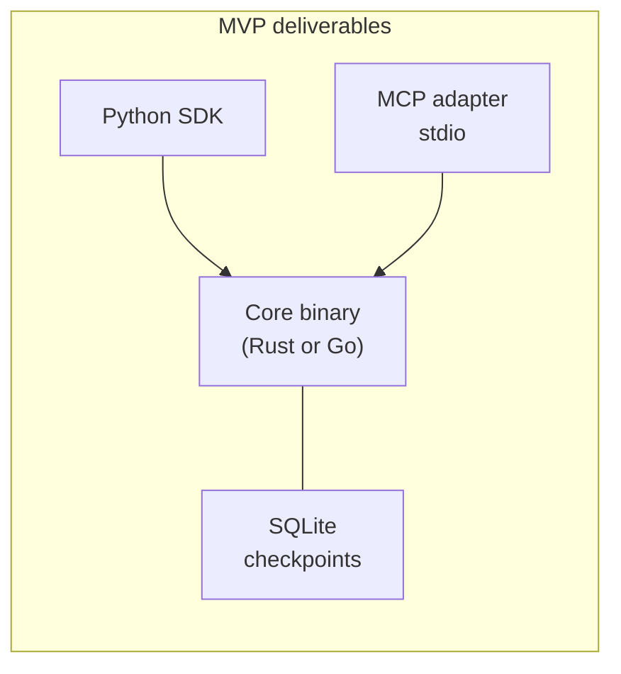

# RFC — Section 8: Reference Implementation Plan

**RFC index (root):** [Agent Workflow Protocol — RFC (overview)](rfc-00-overview.md) · *Section 8 of 9*  
**Series:** Agent Workflow Protocol (working title)  
**Related:** [Execution Model](rfc-04-execution-model.md) · [Integration Interfaces](rfc-05-integration-interfaces.md) · [Governance and Adoption](rfc-09-governance-adoption.md)

---

## 8.1 Minimum viable engine

The reference program **SHOULD** ship:

| Component | Requirement |
|-----------|-------------|
| **Core runtime** | Single binary (Rust or Go recommended) implementing validation, graph walk, command/event loop, replay tests. |
| **Checkpoint store** | **SQLite** backend for durability (file or embedded). |
| **Python SDK** | Client + local in-process embedding against core via FFI or subprocess RPC. |
| **MCP server** | stdio transport implementing §5.2 minimal tool set. |

TypeScript SDK **SHOULD** follow in the first public milestone if resources allow.

Reference component diagram (informative):



## 8.2 Conformance tests

Provide an open **conformance suite** covering:

- Schema validation (fixtures for valid/invalid documents).  
- Replay: inject history, assert identical command stream through tail.  
- Reducers: append/merge/overwrite matrices.  
- Parallel joins: `all`, `any`, `n_of_m` edge cases.  
- Interrupt resume: schema validation failures vs success.  
- MCP tool mapping roundtrip for a mock server.

## 8.3 First three reference workflows

Ship runnable examples (definitions + seeds):

1. **Customer support routing** — `llm_call` + `switch` + `interrupt` + MCP `tool_call`.  
2. **Research and summarize** — `parallel` + multiple `tool_call` + final `llm_call`.  
3. **Multi-agent coding** — `agent_delegate` (mock A2A) + `subworkflow` + approval interrupt.

## 8.4 Repository layout (informative)

```
/core          # engine
/sdk/python
/sdk/typescript
/adapters/mcp
/adapters/rest
/schemas       # JSON Schema bundle
/conformance   # test vectors
/examples      # reference workflows
```

## 8.5 Performance and scaling (non-normative)

Initial target: single-tenant laptop/demo deployments with hundreds of concurrent executions. Horizontal scaling, multi-region checkpoint stores, and activity worker pools are **out of scope** for MVP but **SHOULD** be architecturally plausible via pluggable stores and queues.
