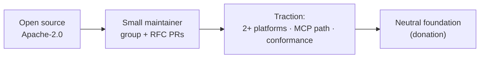

# RFC — Section 9: Governance and Adoption Strategy

**RFC index (root):** [Agent Workflow Protocol — RFC (overview)](rfc-00-overview.md) · *Section 9 of 9*  
**Series:** Agent Workflow Protocol (working title)  
**Related:** [Abstract and Motivation](rfc-01-abstract-motivation.md) · [Reference Implementation](rfc-08-reference-implementation.md)

---

Suggested governance journey (informative):

## 9.1 License

Reference code and schemas **SHOULD** use **Apache-2.0** unless a neutral foundation mandates another OSI-approved license.

## 9.2 Maintainers

Start with a **small maintainer group** for fast decisions; use **RFC PRs** with template checklist (schema, security, tests). **Public issue tracker** and **versioned changelogs** are **REQUIRED** from first release.

## 9.3 Neutral home

After initial traction (multiple independent adopters, working MCP + SDK surfaces), contributors **SHOULD** pursue donation to a **neutral foundation** (e.g. Linux Foundation–adjacent consortia aligned with MCP/A2A ecosystems).

## 9.4 Adoption criteria

**Success signals:**

- At least **two competing platforms** (e.g. one assistant host and one automation/business workflow product) ship **interoperable** support using the canonical JSON.  
- **MCP** entry path documented and demoed end-to-end.  
- **Conformance suite** passing on main for tagged releases.

## 9.5 Developer experience bar

A new user **SHOULD** reach **first successful execution** in **under five minutes** using quickstart docs:

- `docker run` or single-binary download  
- One example workflow file  
- One command (or MCP tool call) to start and print status

## 9.6 Versioning

- **Semantic versioning** for schemas and tooling (`MAJOR.MINOR.PATCH`).  
- **Breaking** schema changes **MUST** increment **MAJOR** and provide migration notes.  
- Engines **MUST** advertise supported spec versions (see §5.7).

## 9.7 Name and identifiers

Final **protocol name** and **schema URI** are **TBD** by steering group; working titles **MUST NOT** be treated as stable namespaces until registered.
