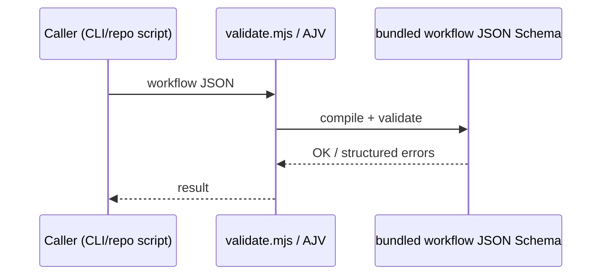
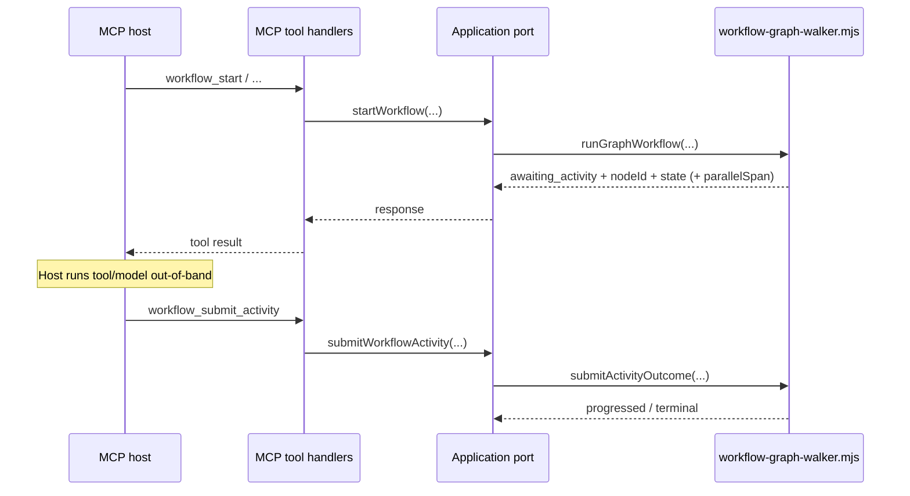

# 6. Runtime View

## 6.1 Scenario: Validate workflow definition

Evidence: `packages/engine/src/validate.mjs`, root `npm run validate-workflows` pipeline.

## 6.2 Scenario: Start execution (library or MCP)

Narrative (validate → run → terminate or yield):

1. Workflow definition validated against the bundled workflow JSON Schema and static engine-profile constraints (**Section 6.1**, or callers may pre-validate explicitly).
2. Execution starts from **input-bound** initial state (**`runGraphWorkflow`**); execution id minted unless supplied.
3. Graph walker schedules nodes and records command/event pairs as each node completes or fails.
4. **Reducer**/`jq`-shaped state updates merge per node completion semantics.
5. Run ends **`completed`**, **`failed`**, **`interrupted`**, or yields **`awaiting_activity`** under **`activityExecutionMode: "host_mediated"`** on an activity boundary.

**Delegation:** Application port abstracts this for MCP; see `createWorkflowApplicationPort` in `packages/engine/src/application/workflow-application-port.mjs`.

### 6.2.1 Library entrypoints (replay spine)

Exported orchestrators used by `createWorkflowApplicationPort` (**`workflow-graph-walker.mjs`**): **`runGraphWorkflow`**, **`resumeGraphWorkflow`** (after **`InterruptRaised` / interrupt completion** semantics), **`submitActivityOutcome`** (host-mediated completions). Checkpoint events materialize inside the walker at deterministic boundaries (**Section 6.4**, **8.6**).

### 6.2.2 MCP integration loop (`workflows-engine-mcp`)

1. MCP host invokes **`workflow_start`** with definition + **`input`**.
2. Tool handlers delegate to **`createWorkflowApplicationPort`** → **`runGraphWorkflow`** (or deterministic continuation pathways after submit/resume—see Sections **6.3–6.4**).
3. Host observes progress via **`workflow_status`** (**`workflow_status`** **`phase`** values include **`running`**, **`completed`**, **`failed`**, **`interrupted`**, **`awaiting_activity`**).
4. Host calls **`workflow_resume`** with **`resumePayload`** after **`interrupt`** milestones, and **`workflow_submit_activity`** when **`phase`** is **`awaiting_activity`** on a **`host_mediated`** boundary (operator walkthrough [`../arc42-assets/runbooks/mcp-stdio-host-smoke.md`](../arc42-assets/runbooks/mcp-stdio-host-smoke.md)).

**Integration parity harness:** `conformance/vectors/parity/` runs table-driven scenarios against the application port and MCP handlers in-process ([`../arc42-assets/contracts/integration-parity-matrix.md`](../arc42-assets/contracts/integration-parity-matrix.md)). Native **`subworkflow`** and **`agent_delegate`** run in the walker; parity rows for status correlation stay `pending` until [#8](https://github.com/benvdbergh/workflows/issues/8) projects `child_execution_id` / `delegate_correlation_id` on `workflow_status`.

## 6.3 Scenario: Interrupt and resume

Stepwise flow:

1. Walker reaches **`interrupt`**; persists interrupt semantics in the execution history (**`InterruptRaised`**, modeled per RFC/profile).
2. Execution pausable with **`interrupted`**/equivalent surfaced to integrators (`workflow_status`, library responses)—context remains in persisted history + definition.
3. Resume payload validated against **`resume_schema`** when the profile attaches one.
4. On success, deterministic continuation follows the **`interrupt`** node's static successor; invalid or mismatched resumes fail with **typed** failures/codes surfaced through the MCP adapter.
5. Replay-based recovery after partial progress reuses **`resumeGraphWorkflow`** + reconstructed history (**same deterministic stepping** principle as crash mid-run recovery).

## 6.4 Scenario: Host-mediated activity (ADR-0002)

Detailed stepping (replay spine):

1. Engine reaches **`step`/`llm_call`/`tool_call`** with **`activityExecutionMode: "host_mediated"`**, appends **`ActivityRequested`** (embedding optional **`parallelSpan`** under **`parallel`**), and returns **`awaiting_activity`** with **`nodeId`**, latest workflow **`state`**, and **`parallelSpan`** when applicable (**`workflow_start`** / **`workflow_status`** surface the same expectation).
2. Engine **does not** invoke **`ActivityExecutor`** for that logical activity until **`ActivityCompleted`/`ActivityFailed`** already exist when replaying the prefix (mid-run replay) **or** the host later submits them.
3. Host performs MCP/LLM/manual work **out of process**, then calls **`submitActivityOutcome`** or **`workflow_submit_activity`** supplying the **same `input`** as the original **`startWorkflow`** (**replay reconstruction**), **`nodeId`**, optional **`expectedParallelSpan`**, and typed success/failure outcome.
4. Engine appends **`ActivityCompleted`** or **`ActivityFailed`**. **`runGraphWorkflow`** then continues from reconstructed history (**identical stepping** to automated crash recovery paths). **`workflow_status`** exposes phase **`awaiting_activity`** exactly when the **latest non-checkpoint** event leaves the run pending on **`ActivityRequested`**.
5. On **replay** (resume after durable history write, crash, or conformance prefix), completions already recorded **must not** duplicate host round trips for the satisfied node—the walker replays deterministic outcomes from history alone.

**Checkpointing:** Checkpoint events emit at deterministic graph-walker boundaries; parallel-branch checkpoints can carry **`parallelSpan`** snapshots (parallel node id, join target, branch label, branch entry) alongside inlined state excerpts for correlated recovery submits.

Further operator procedure: [`../arc42-assets/runbooks/mcp-stdio-host-smoke.md`](../arc42-assets/runbooks/mcp-stdio-host-smoke.md).

## 6.5 Scenario: Conformance replay vector (`kind: "replay"`)

1. Harness loads fixture definition + optional history prefix under `conformance/vectors/replay/**`.
2. Invokes graph runner stepping with scripted activity submits / expectations.
3. Emits normalized JSON summary to stdout (`conformance/run-conformance.mjs`).

Further walkthrough artifacts: [`../arc42-assets/demos/`](../arc42-assets/README.md) (see **demos** in the index).

## 6.6 Parallel branches and correlation

Activities under **`parallel`** carry **`parallelSpan`** correlation (**parallel node id**, **join target**, **branch name**, **branch entry node id**) for submit/status parity—wired through application port types (**`workflow-application-port.mjs`**) so automated hosts correlate pending branches safely. Checkpoints emitted after intra-branch transitions can embed the same **correlation envelope** beside state payloads for deterministic recovery narratives.

---

**Improvement candidates**

1. Embed **diagram source** snippets (or draw.io links) beside Mermaid above for stakeholder-friendly editing.
2. Add an explicit **`awaiting_activity` state machine** mini-diagram to reduce integration bugs for third-party hosts.
3. Automate **sequence diagram drift checks** by linking each scenario to at least one **conformance vector + test name** table row.
