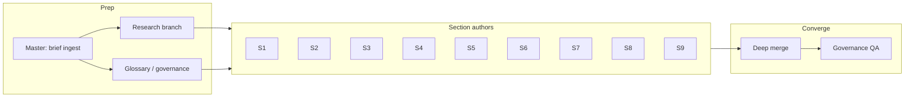

# RFC authoring orchestration plan

**Master agent:** orchestrates section agents, merge passes, and quality gates.  
**Canonical source narrative:** `docs/analysis-brief.md`  
**Final deliverables:** `docs/rfc-00-overview.md` (entry) + one file per RFC section `docs/rfc-01`…`rfc-09` (see §2).  
**Temporary workspace:** `temp/` — plans, hand-offs, research notes, merge checklists; not part of the normative RFC.

---

## 1. Temp folder conventions

| Path pattern | Purpose |
|--------------|---------|
| `temp/rfc-authoring-plan.md` | This runbook (orchestration + skill map). |
| `temp/handoff-glossary.md` | Locked terms, node type names, MUST/SHOULD usage — read before authoring any section. |
| `temp/handoff-research-notes.md` | Citations, dates, “verify externally” flags; optional. |
| `temp/merge-checklist.md` | Cross-reference and de-duplication checklist before “done.” |

Agents (human or automated) **must** read `temp/handoff-glossary.md` before writing normative text. They **may** leave delta notes in `temp/` for the master agent (e.g. `temp/handoff-s03-open-questions.md`).

---

## 2. Output files (`docs/`)

| # | File | Section title |
|---|------|----------------|
| 0 | **`docs/rfc-00-overview.md`** | **RFC entry / index (root link; bundles TOC + links to all sections + analysis-brief)** |
| 1 | `docs/rfc-01-abstract-motivation.md` | Abstract and Motivation |
| 2 | `docs/rfc-02-design-principles.md` | Design Principles |
| 3 | `docs/rfc-03-workflow-definition-schema.md` | Workflow Definition Schema |
| 4 | `docs/rfc-04-execution-model.md` | Execution Model |
| 5 | `docs/rfc-05-integration-interfaces.md` | Integration Interfaces |
| 6 | `docs/rfc-06-interoperability.md` | Interoperability |
| 7 | `docs/rfc-07-security-model.md` | Security Model |
| 8 | `docs/rfc-08-reference-implementation.md` | Reference Implementation Plan |
| 9 | `docs/rfc-09-governance-adoption.md` | Governance and Adoption Strategy |

Optional (non-normative): `docs/rfc-appendix-sources.md` — bibliography; glossary may stay in `temp/` only unless promoted.

---

## 3. Multi-agent workflow (DAG)

**Wave order (minimize rework):**

1. **Wave 0:** Glossary + governance rules (`temp/handoff-glossary.md`).  
2. **Wave 1:** S1, S2, S3 (motivation, principles, schema — vocabulary anchor).  
3. **Wave 2:** S4, S5 (execution + interfaces depend on S3 terms).  
4. **Wave 3:** S6, S7 (interop + security).  
5. **Wave 4:** S8, S9 (implementation + governance).  
6. **Merge:** `document-deep-merge` equivalent — cross-links, duplicate removal.  
7. **QA:** `documentation-governance` checklist (`temp/merge-checklist.md`).

---

## 4. Agent roster and skills

| Agent role | Output | Skills (use installed path) |
|------------|--------|-----------------------------|
| **Orchestrator / PM** | Run order, acceptance criteria | `project-planning`, `specification` |
| **Research** | `temp/handoff-research-notes.md` | `deep-research`, `research-analysis` |
| **Glossary / governance** | `temp/handoff-glossary.md` | `product-knowledge-catalog`, `documentation-governance` |
| **S1 Narrative** | `rfc-01-*.md` | `tech-documentation`, `specification`, `enterprise-architecture` |
| **S2 Principles** | `rfc-02-*.md` | `software-architecture`, `documentation-governance` |
| **S3 Schema** | `rfc-03-*.md` | `specification`, `software-architecture`, `diagram` (figures) |
| **S4 Execution** | `rfc-04-*.md` | `software-architecture`, `diagram`, `enterprise-architecture` |
| **S5 Interfaces** | `rfc-05-*.md` | `specification`, `tech-documentation`, `microsoft-code-reference` (if MS APIs cited) |
| **S6 Interop** | `rfc-06-*.md` | `enterprise-architecture`, `research-analysis`, `tech-documentation` |
| **S7 Security** | `rfc-07-*.md` | `software-architecture`, `research-analysis`, `documentation-governance` |
| **S8 Ref impl** | `rfc-08-*.md` | `software-architecture`, `specification`, `minimalist-coding` |
| **S9 Governance** | `rfc-09-*.md` | `project-planning`, `research-analysis`, `tech-documentation` |
| **Merge editor** | Edits across `docs/rfc-00-overview.md` + `docs/rfc-01`…`rfc-09` | `document-deep-merge` |
| **Doc QA** | `temp/merge-checklist.md` completion | `documentation-governance` |

---

## 5. Done criteria (per section file)

- Uses terminology from `temp/handoff-glossary.md`.  
- Normative language: **MUST** / **SHOULD** / **MAY** where appropriate.  
- Cross-links to sibling RFC files with relative paths (e.g. `[Execution Model](rfc-04-execution-model.md)`).  
- S3: JSON Schema described; eleven node types; jq; three worked examples.  
- S4: Command/Event taxonomy and replay rules stated for implementers.  
- S5: MCP and REST/SDK surfaces at interface level; OpenAPI strategy stated.

---

## 6. Execution log (master agent)

| Step | Status | Notes |
|------|--------|-------|
| Write `temp/rfc-authoring-plan.md` | Done | — |
| Write `temp/handoff-glossary.md` | Done | Includes 12-type / 11-bullet note |
| Write `temp/handoff-research-notes.md` | Done | Verify-before-publish list |
| Write `docs/rfc-00-overview.md` | Done | Canonical TOC + quick links |
| Write `docs/rfc-01` … `rfc-09` | Done | First full draft |
| Write `temp/merge-checklist.md` | Done | QA before “merge ready” |
| Merge pass (cross-file dedup + checklist) | Done | 2026-04-12: paths aligned to `rfc-00-overview.md` + `analysis-brief.md`; `temp/merge-checklist.md` validation run |

*Update this table as waves complete.*
