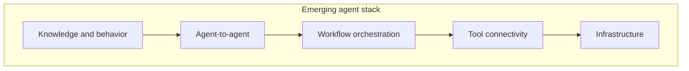

# Agent Workflow Protocol — Whitepaper

**Status:** Working draft (alpha)  
**Audience:** Evaluators, architects, and product leaders  
**Normative specification:** [RFC shards](https://github.com/benvdbergh/workflows/tree/main/docs/RFC) (implementers)  
**Engine profile:** [engine-profile.md](https://github.com/benvdbergh/workflows/blob/main/docs/engine-profile.md)  
**Reference engine:** `@agent-workflow/engine@0.1.2`

---

## 1. Executive summary

Agentic platforms excel at model reasoning and tool use, but lack a **vendor-neutral standard** for durable, auditable, multi-step orchestration: branching, parallelism, human review, crash recovery, and cross-platform reuse of workflow definitions.

The **Agent Workflow Protocol** defines:

- A **declarative workflow document** (canonical JSON; YAML and SDK authoring paths normalize to JSON)
- An **event-sourced execution model** with deterministic replay and checkpoints
- **Integration surfaces** (MCP-first in the reference engine; REST and SDK parity on the roadmap)

The protocol sits **between** atomic tool connectivity (MCP) and agent-to-agent collaboration (A2A): it coordinates stateful plans that invoke tools and delegate to other agents without locking adopters to a single framework or language.

---

## 2. The problem

Production agent systems need capabilities that remain fragmented across today's frameworks:

| Capability | Why it matters |
|------------|----------------|
| Durable checkpoint and resume | Survive process restarts without redoing completed work inconsistently |
| Determinism boundary | Separate orchestration logic from non-deterministic LLM/tool activities |
| Retry, timeout, compensation | First-class policies, not ad hoc code in every integration |
| Human-in-the-loop | Typed interrupts with audit trails |
| Portable definitions | Version, share, and run workflows on more than one engine |

Landscape research ([analysis brief](https://github.com/benvdbergh/workflows/blob/main/docs/research/analysis-brief.md)) shows no single framework combines all of these in an **interoperable, declarative** package. Graph-native runtimes often remain code-first and ecosystem-specific.

---

## 3. Standards stack



| Layer | Role | Examples |
|-------|------|----------|
| Knowledge / behavior | Skills, instructions | Agent Skills, AGENTS.md |
| Agent-to-agent | Delegation, tasks | A2A |
| **Workflow orchestration** | **Stateful multi-step plans** | **This protocol** |
| Tool connectivity | Atomic capabilities | MCP |
| Infrastructure | Discovery, identity | AGNTCY, observability |

MCP demonstrated that a small, working standard can achieve rapid cross-platform adoption. This protocol targets the adjacent pain: **orchestrating** multi-step execution while composing MCP for tool steps and A2A-style patterns for delegation.

---

## 4. Design principles

Eight principles guide the specification:

1. **Vendor-neutral** — Canonical JSON interchange; no single language required.
2. **Declarative-first** — SDKs compile to the same document model without extra semantics.
3. **Deterministic replay** — Orchestration replays from append-only command/event history; non-deterministic work runs in recorded activities.
4. **Checkpointable** — Resume after failure without inconsistent re-execution of completed activities.
5. **MCP-compatible tools** — Tool invocation aligns with MCP where possible.
6. **Security in v1** — AuthZ, secrets, and audit are first-class, not retrofits.
7. **Composability** — Compose with MCP, A2A, and optional durable backends rather than replacing them.
8. **Small surface** — Bounded node kinds, jq expressions, clear command/event model.

---

## 5. Protocol overview

### 5.1 Workflow document

A workflow document describes:

- **Metadata** (`document.schema`, `name`, `version`)
- **State shape** (`state_schema` with optional reducers)
- **Nodes** (typed steps: LLM, tools, switch, interrupt, parallel, wait, delegation, sub-workflows, …)
- **Edges** (directed graph connectivity)
- **Optional checkpoint policy**

Authoring in YAML is fine; engines consume **canonical JSON**.

### 5.2 Node kinds (conceptual)

Twelve `type` discriminators cover common orchestration patterns:

| Category | Types |
|----------|-------|
| Control flow | `start`, `end`, `switch`, `parallel`, `wait` |
| Activities | `step`, `llm_call`, `tool_call` |
| Human / agent | `interrupt`, `agent_delegate` |
| State / composition | `set_state`, `subworkflow` |

### 5.3 Execution model

Execution proceeds as an append-only **command and event** history:

- Commands express intent (start, resume, submit activity, …)
- Events record facts (node entered, activity completed, checkpoint written, …)
- **Replay** re-drives deterministic orchestration against recorded events
- **Checkpoints** bind execution state to a canonical definition hash for safe resume

Human-in-the-loop uses `interrupt` nodes with typed `resume_schema` payloads.

### 5.4 Expressions and state

- **jq** evaluates conditions (`switch`), assignments (`set_state`), and mappings
- **Reducers** (`overwrite`, `append`, `merge`) control how outputs merge into state

---

## 6. Integration story

### Alpha reality (reference engine)

The reference Node.js package (`@agent-workflow/engine`) ships:

- JSON Schema validation
- Graph walker with `switch`, `interrupt`/resume, `parallel`, `wait`, `set_state`
- `agent_delegate` and `subworkflow` (mock A2A; registered child refs)
- **MCP stdio adapter** (`workflows-engine-mcp`) as the primary operator surface

REST and language SDK parity are **roadmap** items (R3/R4), not alpha promises.

### MCP operator path

Hosts configure:

```json
{
  "mcpServers": {
    "agent-workflow-engine": {
      "command": "npx",
      "args": ["-y", "-p", "@agent-workflow/engine@0.1.2", "workflows-engine-mcp"]
    }
  }
}
```

Tools: `workflow_start`, `workflow_status`, `workflow_resume`, `workflow_submit_activity`.

See the [MCP operator guide](../user/mcp-operator-guide.md) for the canonical setup.

### Honest capability bounds

The [compatibility matrix](../user/compatibility.md) documents gaps:

- `retry` / `timeout` accepted by schema but not applied by the walker yet
- `wait.signal` requires a host
- `interrupt` inside `parallel` branches is refused
- Production A2A/MCP delegate adapters are not bundled

---

## 7. Security posture

Security is designed in from the start (RFC-07), with an alpha baseline for the reference package:

- Transport payload limits and schema validation at MCP boundaries
- Secret key redaction in persisted events
- Engine-direct command allowlists for operator manifests
- Private vulnerability reporting via `SECURITY.md`

Deferred to GA: scoped MCP tokens, cryptographic definition signing, full sandboxing.

Operators: [security checklist](../user/security-operators.md).

---

## 8. Adoption and governance

### Versioning

- **Pre-1.0 alpha:** SemVer `0.y.z`; breaking changes bump minor per project policy
- **`document.schema`:** URI identifying protocol profile (registry publication at GA)
- **`document.version`:** Per-workflow authoring semver

### Roadmap horizons

| Horizon | Intent |
|---------|--------|
| R2 Beta | Core orchestration: `parallel`, `wait`, `set_state` |
| R3 RC | Delegation, sub-workflows, integration parity |
| R4 GA | v1 contract freeze, security baseline, conformance tag |
| R5+ | Scale and ecosystem |

See [ROADMAP.md](https://github.com/benvdbergh/workflows/blob/main/ROADMAP.md).

### Open governance items

Protocol name, final schema URI registry, and neutral foundation home remain **TBD** (RFC-09). Alpha adopters should expect contract evolution with documented release notes.

---

## 9. Appendices

### A. Normative specification

Nine RFC sections for implementers:

- [RFC overview](https://github.com/benvdbergh/workflows/blob/main/docs/RFC/rfc-00-overview.md)
- [Workflow definition schema](https://github.com/benvdbergh/workflows/blob/main/docs/RFC/rfc-03-workflow-definition-schema.md)
- [Execution model](https://github.com/benvdbergh/workflows/blob/main/docs/RFC/rfc-04-execution-model.md)
- [Integration interfaces](https://github.com/benvdbergh/workflows/blob/main/docs/RFC/rfc-05-integration-interfaces.md)
- [Security model](https://github.com/benvdbergh/workflows/blob/main/docs/RFC/rfc-07-security-model.md)

### B. Machine-readable contract

- JSON Schema: [download](../user/schema/index.md) or [schemas/workflow-definition.json](https://github.com/benvdbergh/workflows/blob/main/schemas/workflow-definition.json)
- Golden fixtures: [examples/](https://github.com/benvdbergh/workflows/tree/main/examples)
- Conformance harness: [conformance/README.md](https://github.com/benvdbergh/workflows/blob/main/conformance/README.md)

### C. Landscape research

Founding market and competitive analysis: [analysis-brief.md](https://github.com/benvdbergh/workflows/blob/main/docs/research/analysis-brief.md) (supporting context, not normative).

### D. End-user documentation

- [Getting started](../user/getting-started.md)
- [Author workflows](../user/authoring-workflows.md)
- [Release notes](https://benvdbergh.github.io/workflows/latest/release-notes/)

---

*This whitepaper is a narrative overview. For implementation and conformance, use the RFC set and engine profile.*
